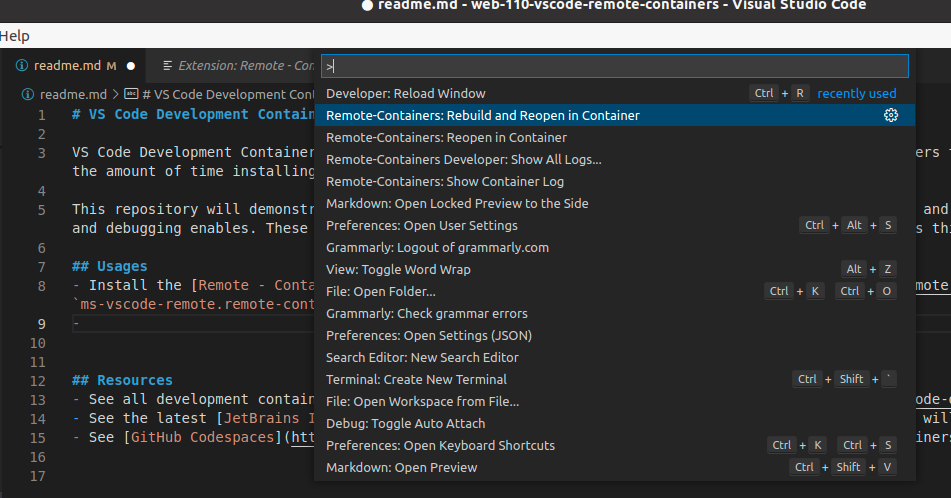
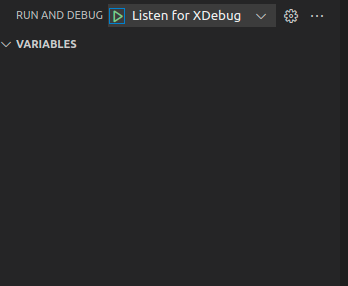

# VS Code Development Containers

VS Code Development Containers and workspaces are powerful new development tools that enable developers to share consistent development environments and reduce the time of installing tooling and bugs related to tooling.

This repository will demonstrate using a development container for building a custom WordPress theme and plugin. The development container has PHP IntelliSense and debugging enables. These things take some time to set up manually, so a container like this makes things very quick.

## Usages
- Install the [Remote - Containers](https://marketplace.visualstudio.com/items?itemName=ms-vscode-remote.remote-containers) extension (identifier `ms-vscode-remote.remote-containers`).
- Create a `.env` file based on the `.env.template`.
- Open the command window and select **Rebuild and Reopen in Container**.

- You will now find yourself in the container with WordPress installed in the `html` folder.
- Go to [http://localhost:8000](http://localhost:8000) in your browser to access the WordPress installation
- Go to [http://localhost:8080](http://localhost:8080) in your browser to access the PHP MyAdmin.

## Notes
- We use a `docker-compose.yml` to define the container and map our plugins, themes, and development files into the container. You may use `git` in the development container as you would on your local computer.
- A [devcontainer.json](./.devcontainer/devcontainer.json) file controls which user, directory, and extensions are installed in our container.
- This tutorial uses the official WordPress docker image. This image isn't constructed for development, so we use a custom [Dockerfile](./.docker/Dockerfile) to add a few tools and a non-root user.

## Using the Debugger in the Container
- Install the [Xdebug helper](https://chrome.google.com/webstore/detail/xdebug-helper/eadndfjplgieldjbigjakmdgkmoaaaoc?hl=en) browser extension.
- Start the `Listen for XDebug` launch configuration.

- Set a breakpoint in your source code.
- Set the PHP page in your browser to debug using the `Xdebug helper` extension.
- Refresh the page, and VS Code should break in your code.

## Resources
- See all development containers at the [VS Code GitHub repository](https://github.com/microsoft/vscode-dev-containers).
- See the latest [JetBrains IDE Fleet](https://www.jetbrains.com/fleet/) (in private preview), which will be a competitor in this realm.
- See [GitHub Codespaces](https://github.com/features/codespaces), built on top of development containers.

